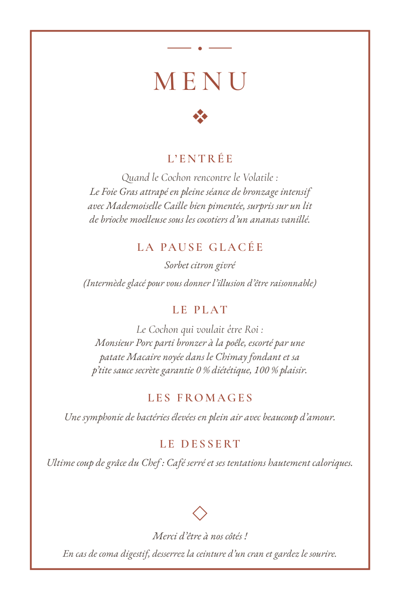

# Template de menu de mariage

Composez un menu de mariage de **12 × 18 cm** prêt à imprimer en modifiant un
seul fichier : [`menu.yaml`](menu.yaml).

```bash
pip install -r requirements.txt
./construire.sh
```

Sous Windows, dans PowerShell :

```powershell
pip install -r requirements.txt
.\construire.ps1
```

La construction produit deux PDF :

| Fichier | Usage |
|---|---|
| `Menu de mariage - 12x18 cm.pdf` | une carte au format fini, pour l'imprimeur |
| `Menu de mariage - A4 - 2 exemplaires.pdf` | deux cartes sur une feuille A4 paysage, avec repères de coupe |



Le contenu d'exemple reprend le menu humoristique fourni : entrée, pause
glacée, plat, fromages, dessert et mot de remerciement. Remplacez simplement
les textes dans `menu.yaml`, puis relancez la construction.

## Ce que le template gère

- format fini exact de 120 × 180 mm ;
- deux exemplaires à taille réelle sur une feuille A4 ;
- repères de coupe autour de chaque carte ;
- polices intégrées au PDF dans un format accepté par les imprimeurs ;
- typographie française automatique ;
- contrôle des marges et détection d'un menu trop long ;
- couleurs, polices, cadre et format configurables depuis le YAML.

Il faut Python 3.9 ou plus, PyYAML, PyMuPDF et Google Chrome ou Chromium.
Consultez la [documentation](docs/README.md) pour l'installation, le contenu,
la personnalisation et l'impression.

## Structure

```text
menu.yaml             votre contenu et vos réglages
construire.sh         crée les deux PDF (Linux, macOS)
construire.ps1        crée les deux PDF (Windows, PowerShell)
exemple/              les PDF d'exemple
docs/                 le guide et les aperçus
moteur/               le moteur de composition
polices/              les polices statiques fournies
build/                fichiers intermédiaires régénérés
```

## Licence

Le code est sous licence MIT. Les polices sont distribuées sous SIL Open Font
License 1.1 ; voir [`polices/LICENCE-POLICES.txt`](polices/LICENCE-POLICES.txt).
