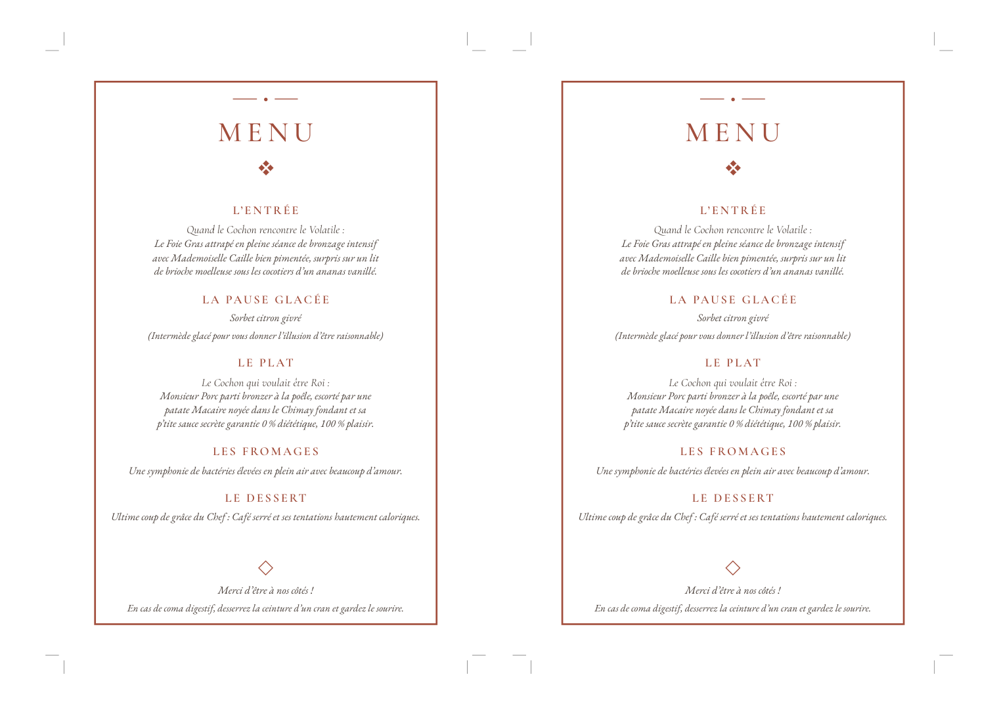

# Documentation

Ce template transforme le contenu de `menu.yaml` en une carte de menu de
12 × 18 cm et en une feuille A4 contenant deux exemplaires à découper.

- [Démarrage](demarrage.md) : installer les outils et créer les PDF.
- [Contenu](contenu.md) : écrire les plats et réutiliser des informations.
- [Mise en page](mise-en-page.md) : comprendre le format et faire tenir le menu.
- [Impression](impression.md) : imprimer la planche A4 sans changer l'échelle.
- [Personnalisation](personnalisation.md) : modifier les couleurs, polices et cadre.
- [Dépannage](depannage.md) : corriger les erreurs les plus courantes.

## Résultat fourni

Le dossier [`exemple/`](../exemple/) contient exactement les fichiers produits
par le `menu.yaml` livré.

La planche ci-dessous contient deux cartes à taille réelle et leurs repères de
coupe :

